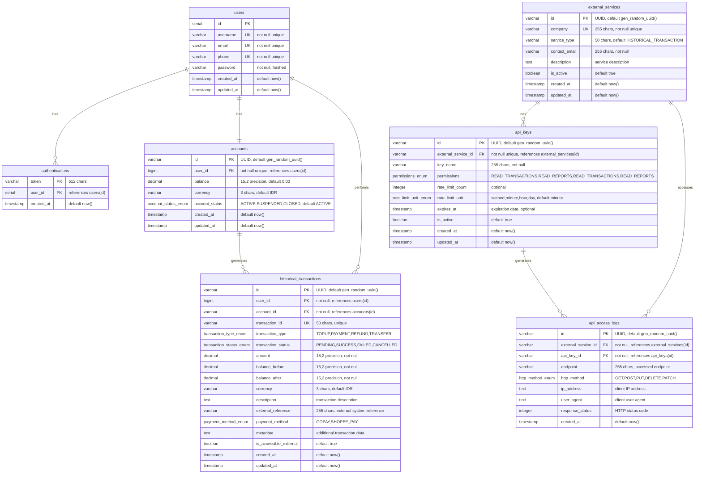

# FP-Main-Ops - One Gate Payment System

Dokumentasi operasional lengkap untuk sistem One Gate Payment, termasuk infrastruktur, database, dan konfigurasi deployment.

##  Daftar Isi

- [Gambaran Umum](#gambaran-umum)
- [Arsitektur Sistem](#arsitektur-sistem)
- [Database Schema](#database-schema)
- [Infrastruktur](#infrastruktur)
- [Deployment](#deployment)
- [Monitoring & Observability](#monitoring--observability)
- [Security](#security)
- [Getting Started](#getting-started)

##  Gambaran Umum

One Gate Payment System adalah platform pembayaran digital yang menyediakan layanan finansial terintegrasi dengan fitur-fitur:

- **Autentikasi & Autorisasi**: Sistem login dan manajemen token JWT
- **Manajemen Akun**: Pengelolaan akun pengguna dan saldo
- **Transaksi**: Sistem pembayaran, top-up, transfer, dan refund
- **API Gateway**: Kong API Gateway dengan rate limiting dan security
- **External API**: API untuk layanan eksternal (Bank Indonesia, OJK)
- **Audit & Logging**: Pencatatan akses API dan audit trail

##  Arsitektur Sistem

### Microservices Architecture
- **Authentication Service**: Menangani registrasi, login, dan refresh token
- **Payment Service**: Manajemen akun, saldo, dan wallet
- **Transaction Service**: Riwayat transaksi dan API eksternal

### API Gateway (Kong)
- Rate limiting per consumer (OJK: 200/min, Bank Indonesia: 100/min)
- JWT authentication untuk internal services
- API Key authentication untuk external services
- CORS configuration dan security headers

##  Database Schema

### ERD (Entity Relationship Diagram)


### Database Migrations
Database schema dikelola menggunakan Flyway dengan migration files:
- `V1__create_users_table.sql` - Tabel pengguna
- `V2__create_authentications_table.sql` - Tabel autentikasi
- `V3__create_accounts_table.sql` - Tabel akun
- `V4__create_historical_transactions_table.sql` - Tabel riwayat transaksi
- `V5__create_external_services_table.sql` - Tabel layanan eksternal
- `V6__create_api_keys_table.sql` - Tabel API keys
- `V7__create_api_access_logs_table.sql` - Tabel log akses API
- `V8__dummy_records.sql` - Data dummy untuk testing

##  Infrastruktur

### OpenShift Deployment
Sistem di-deploy menggunakan OpenShift dengan komponen-komponen:

#### Core Services
- **PostgreSQL**: Database utama dengan StatefulSet
- **Redis**: Caching dan session storage
- **Kong**: API Gateway dengan declarative configuration

#### Monitoring & Observability
- **Prometheus**: Metrics collection
- **Grafana**: Dashboard dan visualisasi
- **Loki**: Log aggregation
- **Tempo**: Distributed tracing
- **OpenTelemetry Collector**: Telemetry data processing

#### CI/CD & Quality
- **Jenkins**: Continuous Integration/Deployment
- **SonarQube**: Code quality analysis
- **Kafka**: Event streaming platform

### Terraform Infrastructure as Code
Infrastructure di-manage menggunakan Terraform untuk Google Cloud Platform:

#### OpenShift Cluster
- **Cluster Name**: `ocp-one-gate-payment`
- **Region**: `asia-southeast2`
- **Master Nodes**: 1
- **Worker Nodes**: 2

#### Network Configuration
- Load balancers untuk high availability
- DNS configuration dengan base domain
- Security groups dan firewall rules

##  Monitoring & Observability

### Metrics (Prometheus + Grafana)
- Application metrics dari services
- Infrastructure metrics dari cluster
- Custom business metrics untuk transactions

### Logging (Loki)
- Centralized logging untuk semua services
- Structured logging dengan correlation IDs
- Log retention dan archiving policies

### Tracing (Tempo + OTEL)
- Distributed tracing untuk microservices
- Request flow visualization
- Performance bottleneck identification

### Alerting
- Critical alerts untuk system failures
- Business alerts untuk transaction anomalies
- SLA monitoring dan uptime tracking

##  Security

### API Security
- JWT authentication untuk internal communication
- API Key authentication untuk external services
- Rate limiting per consumer dengan Kong
- CORS policy dan security headers

### Infrastructure Security
- OpenShift security contexts dan policies
- Network policies untuk service isolation
- Secrets management dengan Kubernetes secrets
- Container image scanning

### Data Protection
- Database encryption at rest
- TLS encryption in transit
- PII data masking dalam logs
- Audit trail untuk semua API access

##  Getting Started

### Prerequisites
- OpenShift CLI (`oc`)
- Terraform >= 1.0
- Kubectl
- Docker/podman

### Setup Development Environment

1. **Clone Repository**
```bash
git clone <repository-url>
cd fp-main-ops
```

2. **Setup Infrastructure**
```bash
cd terraform/openshift
cp terraform.tfvars.example terraform.tfvars
# Edit terraform.tfvars dengan konfigurasi yang sesuai
terraform init
terraform plan
terraform apply
```

3. **Deploy Services**
```bash
# Deploy database
oc apply -f openshift/postgres/

# Deploy Redis
oc apply -f openshift/redis/

# Deploy Kong Gateway
oc apply -f openshift/kong-operator/

# Deploy monitoring stack
oc apply -f openshift/prometheus/
oc apply -f openshift/grafana/
oc apply -f openshift/loki/
oc apply -f openshift/tempo/
```

4. **Run Database Migrations**
```bash
oc apply -f openshift/postgres/migration-job.yaml
```

### Environment Configuration

#### Database Connection
- **Host**: `postgres-service.one-gate-payment.svc.cluster.local`
- **Port**: `5432`
- **Database**: `one_gate_payment`
- **User**: Configured via secrets

#### Redis Connection
- **Host**: `redis-service.one-gate-payment.svc.cluster.local`
- **Port**: `6379`
- **Password**: Configured via secrets

#### Kong Gateway
- **Admin API**: `http://kong-admin:8001`
- **Proxy**: `http://kong-proxy:8000`
- **Configuration**: Declarative via ConfigMap

### API Documentation

#### Authentication Endpoints
- `POST /api/auth/register` - User registration
- `POST /api/auth/login` - User login
- `PUT /api/auth/refresh` - Refresh token
- `DELETE /api/auth/logout` - User logout

#### Payment Endpoints (JWT Required)
- `GET /api/payment/account` - Get account info
- `GET /api/payment/balance` - Get balance
- `GET /api/payment/wallet` - Get wallet info
- `POST /api/payment/wallet/topup` - Top up wallet

#### Transaction Endpoints (API Key Required)
- `GET /api/transaction/histories` - List transactions
- `GET /api/transaction/histories/{id}` - Get transaction details

### Testing

```bash
# Health check
curl http://kong-proxy:8000/health

# Authentication test
curl -X POST http://kong-proxy:8000/api/auth/login \
  -H "Content-Type: application/json" \
  -d '{"username":"test","password":"password"}'

# External API test (with API key)
curl -X GET http://kong-proxy:8000/api/transaction/histories \
  -H "X-API-Key: your-api-key"
```

##  Support & Contact

Untuk support dan pertanyaan teknis, silakan hubungi tim development atau buat issue di repository ini.
